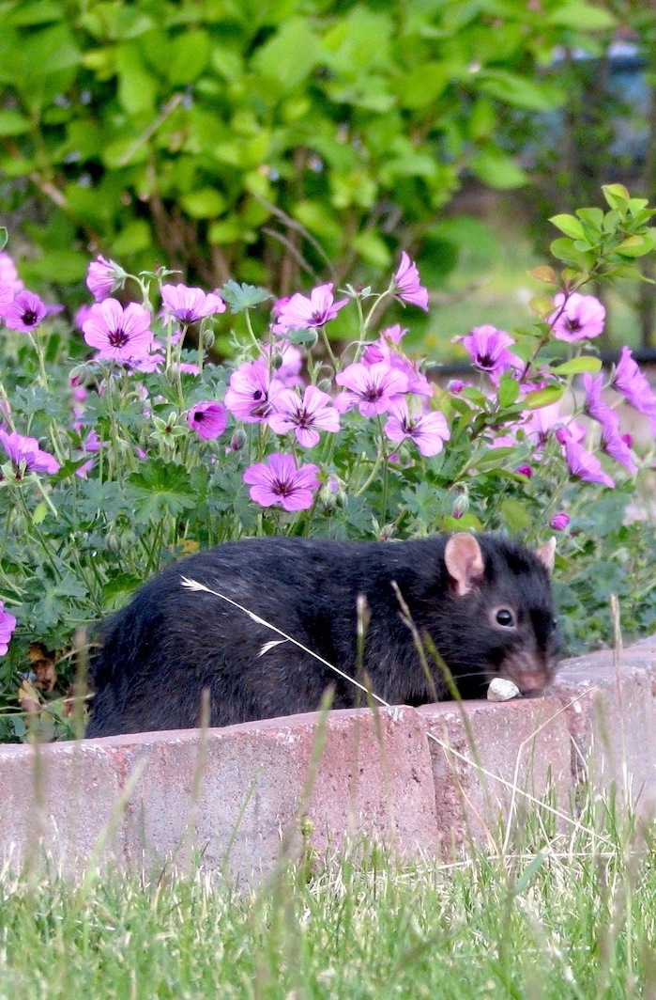

# Rats as pets

Why rats are awesome

---?image=https://static.boredpanda.com/blog/wp-content/uploads/2015/04/cute-pet-rats-42__880.jpg&position=right&size=50%&opacity=20 100%
@title[Heading + List Body]

@snap[west split-screen-heading text-black span-50]
Why rats are awesome
@snapend

@snap[south-west span-30 fragment]
@box[bg-black text-white](They are social)
@snapend

@snap[south span-30 fragment]
@box[bg-black text-white](Curiosity is in their DNA)
@snapend

@snap[south-east span-30 fragment]
@box[bg-black text-white](They come in a multitude of colours)
@snapend

---?image=https://scontent-mad1-1.cdninstagram.com/vp/404efdcfece3ea21790761184f701c87/5CAA9636/t51.2885-15/e35/14295499_1589892817972616_1513863777_n.jpg&size=cover
@title[Heading + List Body]

@snap[west split-screen-heading text-black span-50]
### They are social
@snapend

@snap[north-east span-30 fragment]
@box[bg-purple text-white](Live in packs)
@snapend

@snap[east span-30 fragment]
@box[bg-orange text-white](Need others around them to feel good)
@snapend

@snap[south-east span-30 fragment]
@box[bg-pink text-white](Doesn't have to be tamed in any particular way)
@snapend

---?image=imgs/bg/pink.jpg&position=right&size=50% 100%
@title[Heading + List Body]

@snap[west split-screen-heading text-black span-50]
### Curiosity is in their DNA
@snapend

@snap[east sidebar]

@snapend

---
### They come in a multitude of colours

---?video=https://www.youtube.com/embed/LwlIMoDrIrQ
@title[Fullscreen Video]

@snap[south-east]
<h4>You will never have a dull moment again</h4>
@snapend
